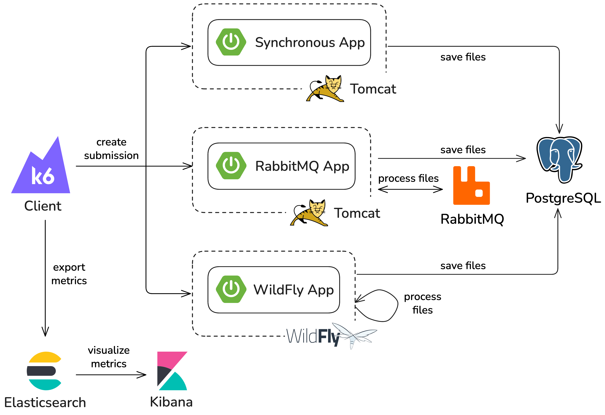
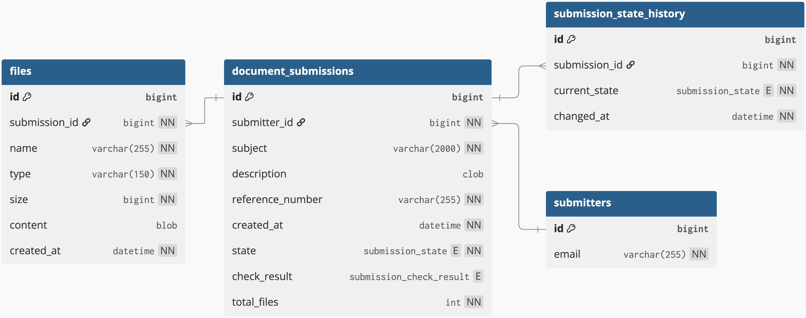

# Bulk Transfer and Processing of Documents in a WildFly Server Environment

The task is to implement a client application that will send electronic documents in XML format, and a server application for receiving and storing these documents.
The server-side processing will be implemented in three ways: direct storage of the received message during request processing, processing the message via the application server’s internal JMS queue, and processing via an external RabbitMQ queue, with the aim of comparing these solutions in terms of performance and the number of documents that can be received simultaneously.

> Technologies: Java, WildFly, RabbitMQ, Docker, PostgreSQL

### 📄 Submission Structure
Each electronic document submission must include the following:

- **File Reference Number** – A unique identifier for the case at the submitter's side, composed of:
  - **Case Type** – Randomly chosen from 'C', 'T', 'P'
  - **Senate Number** – Randomly chosen from '1', '2', '3'
  - **Year** – Current year (e.g., 2025)
  - **Sequential Number** – Order number within the case type, senate, and year
- **Subject** – What the submission is about (max 2000 characters)
- **Submission Text** – A detailed description or message for the recipient (max 32KB characters)
- **Submission Date** – When the sender submitted it
- **Attachments** – Files attached to the submission

> For testing, include files of sizes: ~10KB, 1MB, 10MB, and a random combination of all

- **Submitter Identification** – Email or URL

### 📥 Server-Side Requirements
Upon receiving a submission, the server must:

- **Accept**, **parse**, and **store** the document
- **Send a response** to the submitter about the processing result
- For **asynchronous processing**, the client must **poll** for the result

Additionally, the server must store:

- **Delivery Date** – When the document arrived at the server
- **Response Sent Date** – When the client was notified of the processing result
- **Validation Result** – Normally includes checks such as:
  - Electronic signature validation
  - Malware scan
  - Other submission properties

> For simulation, include at least a 5-second delay to simulate these checks

- **Submission Status** – Track the state of the submission:
  - Received
  - Stored
  - Processed
  - Response Sent

### ⚙️ Processing Modes

1. **Online (Synchronous)**  
   – A web service receives, processes, and responds immediately.

2. **Offline (Asynchronous – Internal JMS Queue)**  
  – The web service receives the document and queues it in the internal JMS queue of the WildFly server.  
  – The client polls periodically for the result.

3. **Offline (Asynchronous – External RabbitMQ Queue)**  
   – The web service receives the document and queues it in an external RabbitMQ instance.  
   – Again, the client polls for updates.

### ❓ Key Question for Testing

    At what volume does the system start to fail or degrade?

This will help compare the performance and scalability of the three processing approaches.

## Implementation

The backend applications are implemented with the following technologies:
- **database**: PostgreSQL 18.
- **core**: Spring Boot 4.0.0 and Java 21.
- **jms-app**: Spring Boot 4.0.0, Java 21, and WildFly 38.0.0.
- **rabbitmq-app**: Spring Boot 4.0.0, Java 25, and RabbitMQ 4.1.4.
- **synchronous-app**: Spring Boot 4.0.0 and Java 25.

### Architecture



### Database



### Docker

#### Build Images

```shell
# Build Synchronous and RabbitMQ App images (from the root directory)
mvn -T 1C -DskipTests package spring-boot:build-image

# Build JMS App image (from the jms-app directory)
cd jms-app
docker build -t jms-app .
```

#### Run Applications

```shell
# Run all applications in Docker Compose
docker compose up -d
```

or selectively run specific applications:

```shell
# Run only the Synchronous App with PostgreSQL
docker compose up -d synchronous-app postgres
```

### Access API Documentation

- **Synchronous App**: `http://localhost:8010/swagger-ui.html`
- **RabbitMQ App**: `http://localhost:8020/swagger-ui.html`
- **JMS App**: `http://localhost:8080/swagger-ui.html`

Every REST API endpoint is prefixed with /api/v1. Example: `http://localhost:8080/api/v1/submissions`

See the provided [Postman Collection](BulkDocTransfer.postman_collection.json) for more details.